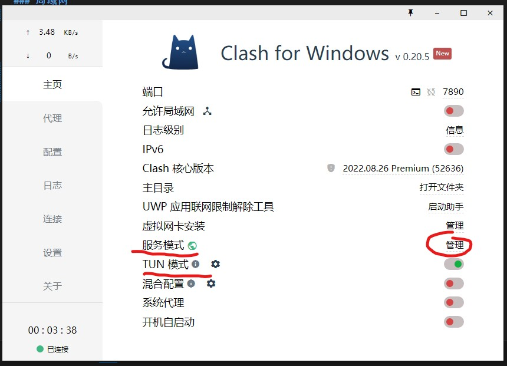
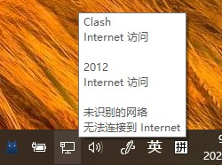
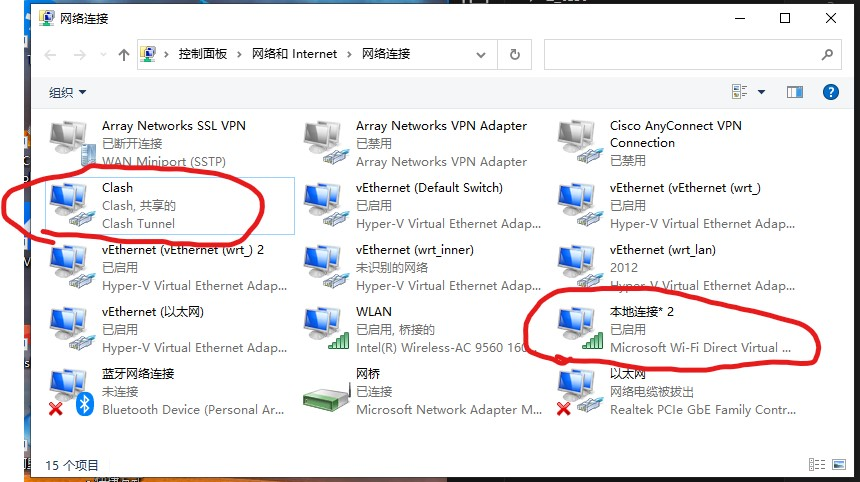
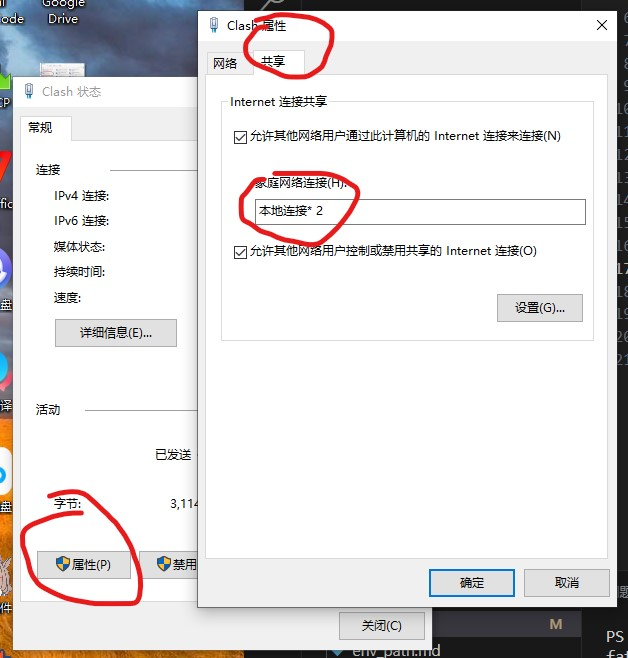

# clash

### 局域网
- clash主机（安卓）
  - 设置->覆写->允许来自局域网的连接->启用
  - 设备连接时填写主机ip，端口7890
  - （switch用代理不能上YouTube但是宝可梦可以联机（NAT A））
- clash主机（PC）
  - 局域网的方法没有设置成功，可能和防火墙有关系
  - 使用TUN模式+热点更方便
  - clash首先安装服务模式，等待重启小地球变绿
  - 
  - 此时右下角网络连接显示为clash
  - 
  - 打开电脑热点，进入更改适配器选项可以看到clash的网卡和热点的网卡（本地连接*2）
  - 
  - clash共享连接到热点
  - 
  - 其他设备连接到热点就可以翻墙
  - （这种方法switch不能联机（NAT F））

